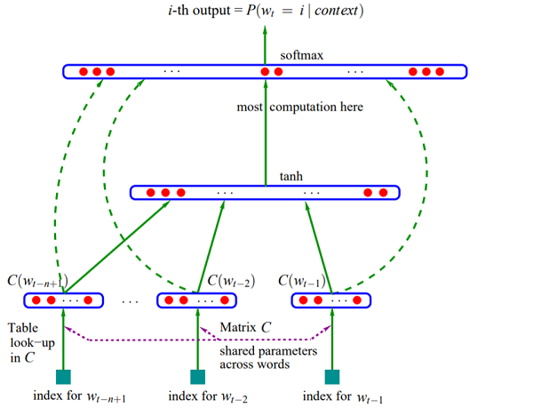

# 文本表示

## 离散表示

### One-hot

        在传统的自然语言处理中，可将词语看作离散的符号：hotel,conference,motel……**单词的向量**可以为独热向量（one-hor vectors，只有一个1，其余均为0的稀疏向量），向量维度=词汇量。使用scikit-learn将语料库中的词转为one-hot，代码示例如下：

```python
from numpy import argmax
from sklearn.preprocessing import LabelEncoder
from sklearn.preprocessing import OneHotEncoder

label_encoder = LabelEncoder()
onehot_encoder = OneHotEncoder(sparse=False, categories='auto')
corpus = [['他', '是', '张三'], ['他', '是', '一名', '老师'], ['它', '是', '一条', '鱼']]  # 分好词的语料库
corpus = sum(corpus, [])  # 由于LabelEncoder处理一维数据，故将语料库排平为一维数据
words_index = label_encoder.fit_transform(corpus)   # 词对应的index
words_onehot = onehot_encoder.fit_transform(words_index.reshape(len(words_index), 1))  # 词对应的one-hot
example_onehot = [1, 0, 0, 0, 0, 0, 0, 0]
word = label_encoder.inverse_transform([argmax(example_onehot)])  # 将onehot转为词
print(word)
```

        one-hot所有向量是正交的，没有相似度的概念；而且向量维度过大，向量稀疏。one-hot常常用于对类别进行编码。

### Bag of Words

        词袋子模型是一种经典的文本表示。**文档的向量**表示可以直接用词的向量求和得到。[]()

```python
from sklearn.feature_extraction.text import CountVectorizer
corpus = ['他 是 是 张三', '他 是 一名 老师', '它 是 一条 鱼']  # 语料库
vectorizer = CountVectorizer(analyzer='word', token_pattern=u"(?u)\\b\\w+\\b")  # 自定义token，防止过滤单个字
vectorizer.fit_transform(corpus)
print('词典', vectorizer.vocabulary_)
print("词袋模型：")
print(vectorizer.fit_transform(corpus).toarray())
```

### TF-IDF

        TF-IDF（term frequency–inverse document frequency）是一种用于信息检索与数据挖掘的常用加权技术。TF是词频(Term Frequency)，IDF是逆文本频率指数(Inverse Document Frequency)。

        词语由t表示，文档由d表示，语料库由D表示。具体计算公式为：

$$
TFIDF(t,d,D)TF(t,d) \cdot IDF(t,D)=TF(t,d) \cdot log\frac{|D|+1}{DF(t,D)+1}
$$

        其中，TF(t,d)是词语t在文档d中出现的次数，|D|是语料库中总的文档数，文件频率DF(t,D)是包含词语的文档的个数。

```python
from sklearn.feature_extraction.text import TfidfVectorizer
corpus = ['他 是 是 张三', '他 是 一名 老师', '它 是 一条 鱼']
# tf-idf
tv = TfidfVectorizer(token_pattern=u"(?u)\\b\\w+\\b")
tv_fit = tv.fit_transform(corpus)
print(tv_fit.toarray())
```

        使用sklesklearn的TfidfVectorizer时，词汇表以及词项的idf值使用训练得到，而tf值由测试文本自身决定。

## 基于SVD降维的表示方法

        这是一种构造词嵌入（即词向量）的方法，首先遍历一个很大的数据集和统计词的共现计数矩阵X，然后对矩阵X进行SVD分解得到$USV^T$，最后使用U的行来作为字典中所有词的词向量。矩阵X主要有以下几种选择：

### 词-文档矩阵

最初的尝试，猜想相关联的单词在同一个文档中会经常出现。例如，“banks” “bonds” “stocks”“moneys”等等，出现在⼀起的概率会⽐较⾼。但是“banks” “octopus” “banana” “hockey”不⼤可能会连续地出现。据此，按照以下方式建立一个word-document矩阵：遍历数亿的文档，当词i出现在文档j时，对$X_{i,j}$加一，最终得到一个很大的矩阵$\mathbb{R}^{|V|\times M}$。

### Window based Co-occurrence Matrix

        由于词-文档矩阵的规模与文档数量M成正比，因此寻找更好的方法。使用矩阵X存储单词的共现，计算每个单词在特定大小的窗口中出现的次数。，从而形成一个关联矩阵。步骤如下：

- 生成维度为$|V|\times |V|的共现矩阵X$

- 在$X$上应用SVD从而得到$X=USV^T$

- 选择$U$前$k$行得到$K$维的词向量

- $\frac{\sum_{i=1}^k\sigma_i}{\sum_{i=1}^|V|\sigma_i}$表示第一个$k$维捕获的方差量

       基于SVD降维的表示方法提供了足够的词向量来编码语义和句法信息，但伴随许多其他问题。

- 矩阵的维度会经常发生改变（经常增加新的单词和语料库的大小会改变）

- 矩阵会非常的稀疏，因为很多次不会共现

- 矩阵维度一般会非常高

- 基于SVD的方法的计算复杂度很高（$m\times n$矩阵的计算成本是$O(mn^2)$），并且很难合并新单词或文档。

- 需要在X上加入一些技巧处理来解决词频的不平衡
  
  下面提到的基于语言模型的方法能合理的解决这些问题。

## 基于语言模型

### 神经语言模型NNLM

        NNLM最初是由Bengio在2003年提出的[A Neural Probabilistic Language Model](https://www.jmlr.org/papers/volume3/bengio03a/bengio03a.pdf)，后来的word2vec便是从其中简化训练而来。考虑一个词表D的大小为N(相当于总共有N个词，词用w表示)，词表中每个词w的维度为M。NNLM的目标函数为：

通过下面的一个三层神经网络，根据前n-1个词预测第n个词的概率



1. 输入是前n-1个词$w_{t-n+1},...,w_{t-1}$，通过映射矩阵C,将输入的每个单词映射为特征向量$C(w_{t-n+1}),...,C(w_{t-1})$，将所有向量串联成维度为$(n-1)m$的向量。

2. 将输入序列的向量建模成概率分布，有函数g实现。函数g的实现可以是前向神经网络、循环神经网络等。论文中的实现为：$y=b+Wx+Utanh(d+Hx)$

3. 为了使概率和为1，将softmax应用于输出层，得到最终结果$P(w_t=i|context)$

        模型训练时，最大化下面式子：$L=\frac{1}{T}\sum_tlogf(w_t,w_{t-1}, ..,w_{t-n+1};\theta)+R(\theta)$

第一部分是最大化给定序列$w_{t-1}, ..,w_{t-n+1}$，下一词是$w_t$的概率，也就是最大化真实序列的概率。第二部分的$R(\theta)$是正则项。采用随机梯度下降的方法进行优化，训练结束后，得到语言模型：输入$w_{t-n+1},...,w_{t-1}$，预测出$w_t$。此外，还得到了**词向量矩阵C**。

### word2vec

        Word2vec模型其实就是简单化的神经网络。但是这个神经网络的学习不是为了准确的预估正确的中心词/周围词，而是为了得到 word—>vector 这个映射关系。上述的NNLM步骤可以分解如下：

1. 构建数据：用原始数据构建单词对，单词形式如下 [input word, out word]，即[data x, label y]。

2. 输入层: 将所有词语进行one-hot编码作为输入，输入的是n维向量(n是词表单词个数)

3. 隐藏层：中间是只有一个隐藏层 (没有激活函数，只是线性的单元)。隐藏层实际上存储了词汇表中所有单词的word vectors。这是一个尺寸为 [vocabulary size x embedding size] 的矩阵。矩阵的每一行对应了某一个单词的word vector。

4. 输出层：输出的也是独热向量。Output Layer维度跟Input Layer的维度一样，各维的值相加为1。用的是Softmax回归。softmax保证输出的向量是一个概率分布。一旦转换为概率之后，我们就可以用到最大似然估计（交叉熵）的方式来求得最大似然或者最小交叉熵。

5. 定义loss损失函数：用来预测正确输出/优化模型。我们的 label y 值是一个概率分布，输出层经过softmax处理后，也是一个概率分布，这样就可以用交叉熵来衡量神经网络的输出与我们的 label y 的差异大小，也就可以定义出loss了。

6. 迭代训练: 采用梯度下降算法，每次迭代比较 prediction 和 label y 之间的loss，然后相应优化，最终确保类似的单词有类似的向量。

7. 最终矩阵：丢去output层，只用隐藏层的输出单元(就是Input Layer和Hidden Layer之间的权重)，构成了Look up table。 

  

         这两个矩阵W都含有V个词向量，也就是说同一个词有两个词向量，我们使用两种策略将其组合形成一个词向量，加起或者拼接，但是为了保证维度，所以一般都是使用加的策略或者直接使用W矩阵。当然直接使用W也是可行的。

那么原始的计算复杂度为（N为输入大小，D暂时可以理解成one-hot大小即V大小，取决于投影方式，H为隐藏层大小，V是词汇表大小）:


        但是后来，因为hidden layer计算不够快，即$N\times D\times H$太慢了，于是直接被砍没了。模型被优化成下图的形式，此时输入已经是D维随机词向量；我们原本输入是个one-hot。投影矩阵W是$V\times N$大小，得到的结果是$1\times N$的向量这些部分全部合在了一起。随机产生一个D维大小的词向量，然后直接进行简单计算，误差就像更新权重矩阵一样直接更新对应的词向量即可。


        此外，论文还采用了了Hierarchical Softmax和Negative Sampling两种方式降低复杂度，这里不再详述。
